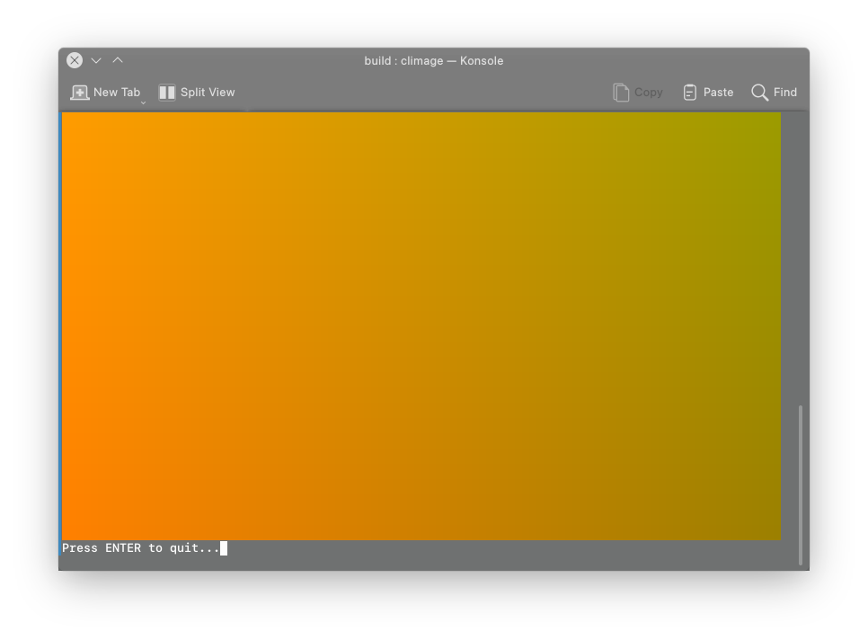

# climage
Display images inside the terminal using 24-bit colors

---

### Current state
Creates a dynamically generated gradient image taken from passed arguments

---

### To-Do
1. :heavy_check_mark: ~~swap **_x_** and **_y_** arguments correctly~~
2. clean up Pixel and Image classes
3. :heavy_check_mark: ~~dynamically get the current terminal size (so that the image can fill whole terminal)~~
4. Create classes that can open some popular image formats (.png, .jpeg, etc.)
5. Translate opened images to the terminal

---

### Building
Make sure to be in the `build/` directory.

Run CMake to configure the project and generate a native build system:

    cmake ../

Call the build system:

    cmake --build .

### Running
    ./climage
